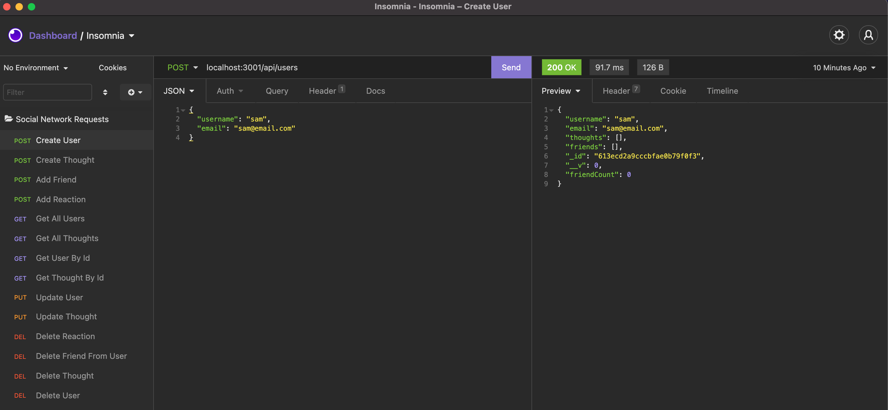
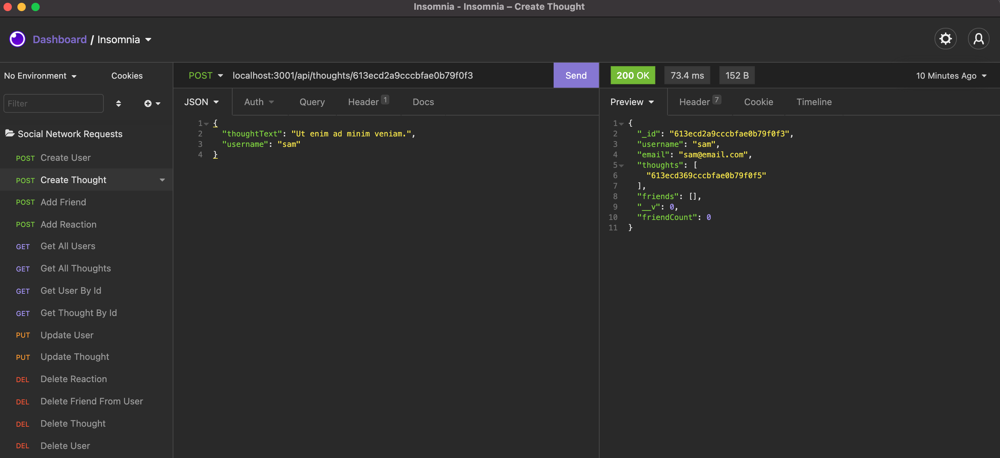
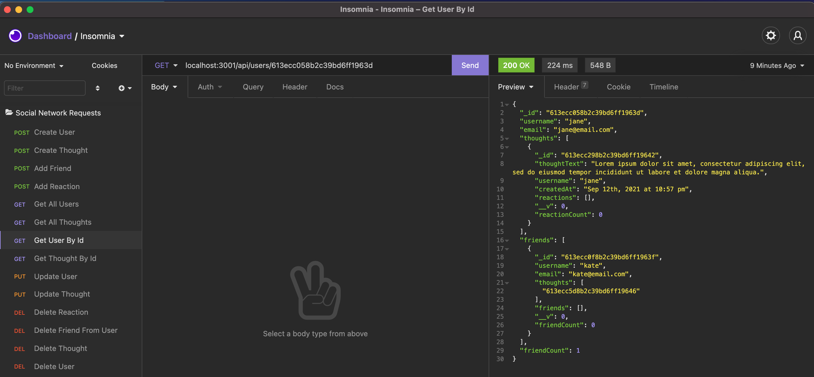

# Social Network API
## NoSQL Challenge

## Description
This week we were challenged to build a social network API using a NoSQL database. This app uses Express.js for server routing, MongoDB as the noSQL database, and Mongoose, an object-modelign tool for MongoDB to perform CRUD operations. This application also uses Moment.js to format timestamps to be more readable.

## Table of Contents
* [Installation](#installation)
* [Usage](#usage)
* [Video Walkthrough](#video-walkthrough)
* [Screenshots](#screenshots)
* [Questions](#questions)

## Installation
To install any necessary dependencies run the following command: 

    npm install

## Usage 
For local usage, clone the repo on you local manchine and open in an IDE. If you haven't already, make sure you have node.js installed as well as npm (check installation: `node -v` & `npm -v`). In the packages root directory, run `npm i` to install the necessary dependencies. These include: mongoose.js, express.js, and moment.js. Once all dependencies are installed, run `npm start` to initiate the applciation. You can use Insomnia core to test the api routes. 

## Video Walkthrough
[Watch video walkthrough](https://drive.google.com/file/d/13zJckZeMBdUDQqWc8GP7wUoSqzBbU6t7/view)

## Screenshots

Create User: 

Create Thought:

Get User By Id:

## Questions
If you have any questions or feedback, create a new issue and add the label "question". 
View more of my work: [github.com/emholmes](https://github.com/emholmes).